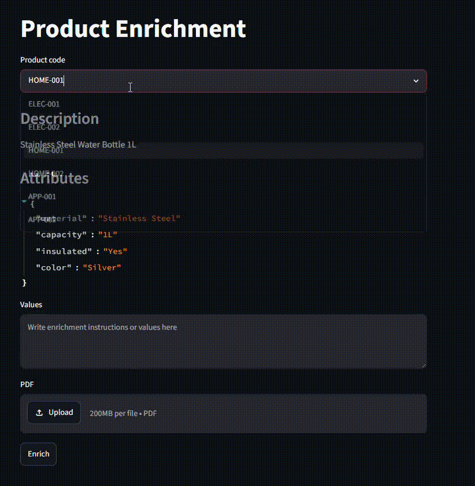

# Product Enhancement POC

A lightweight Proof of Concept (POC) demonstrating AI-powered product enrichment using a multi-agent workflow built with FastAPI, LangGraph, and Streamlit.

## Overview

The application enriches partially complete product information using:

* User-provided context
* External supporting information
* LLM-powered enrichment workflows
* OpenRouter as the LLM provider
* DeepSeek V4 Flash as the default model
* OpenTelemetry-based tracing with Jaeger

The goal is to generate improved, structured product data with minimal manual effort.

## Features

* Product selection from sample data
* Additional context input
* Document ingestion support
* Multi-agent enrichment workflow
* Structured response generation
* Streamlit frontend
* FastAPI backend
* LangGraph orchestration

## Architecture

```text
Streamlit Frontend
        │
        ▼
FastAPI /enrich
        │
        ▼
Enrichment Service
        │
        ▼
LangGraph Workflow
        │
        ├── Retrieval Agent
        └── Enrichment Agent
        │
        ▼
Structured Enriched Output
```

## Tech Stack

* Python 3.11
* FastAPI
* Streamlit
* LangGraph
* LangChain
* Pydantic v2

## Running the Application

### 1. Clone the repository

```bash
git clone https://github.com/debabrot/product-enhancement.git
cd product-enhancement
```

### 2. Configure environment variables

Create a `.env` file from `.env.example` and add the required API keys.

```bash
cp .env.example .env
```

Update the values as required.

### 3. Build and start the application

```bash
docker compose build
docker compose up
```

### 4. Open the application

Access the Streamlit frontend and use the sample products to test the enrichment workflow.

## Example Workflow

1. Select a product from the sample dataset.
2. Provide additional context or supporting information.
3. Optionally upload supporting documentation.
4. Submit the enrichment request.
5. Review the generated enriched product information.

## Project Scope

### Current

* Single enrichment workflow
* User-provided context
* Structured response generation
* Multi-agent orchestration

### Not Included

* Authentication and authorization
* Persistent storage
* Human review workflows
* Vector databases
* Batch processing
* Multi-user support
* Production deployment

## Screenshot



```text
docs/video/demo.mp4
```

## License

See the LICENSE file for details.
